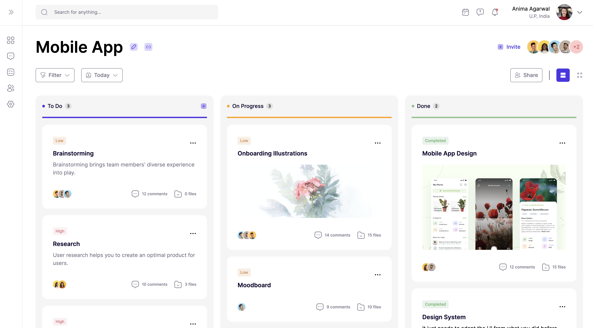

# mercor-frontend-task

## Task

### Kanban Clone

Congratulations on being selected to complete a Mercor project! We conduct final-round interviews for applicants with successful submissions to be a Mercor engineer.

In this project, you will clone a Figma design in React. The deployed code should exactly replicate the original Figma design, including fonts, icons, colors, structure, layout, and spacing.

This is the Figma: https://www.figma.com/file/Paz2INbKkXCSR0Tqb9cmPF/Mercor-Project

### Requirements:

1. Clone the Figma Design in React.

1. Implement the Kanban functionality which allows users to drag cards between columns. For example, a user might drag the “Research” card from the “To Do” column to the top of the “On Progress” column.

1. Implement responsive design techniques to ensure the application is beautiful and performant on mobile devices.

1. Deploy your React application to a hosting platform like Vercel, Netlify, or GitHub pages.

1. Test the deployed application on multiple devices to verify its functionality and responsiveness.

## Submission 

- React (v18), Router(v6), Tailwind(v3) and Node (v20).
- Responsive functional components styled with tw and scss.
- Deployed on Github Pages.
- Deployed Node: [https://mercor.ahampriyanshu.com/](https://mercor.ahampriyanshu.com/)

## Screenshots





## Setup

```bash
git clone https://github.com/ahampriyanshu/mercor-client.git
cd mercor-client
yarn
yarn dev
```

## Deploy

```bash
yarn build
```
